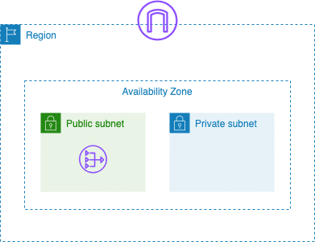
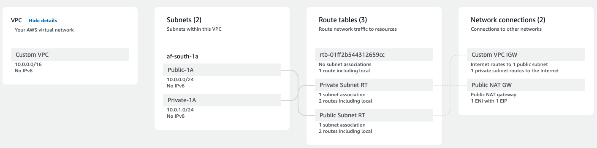
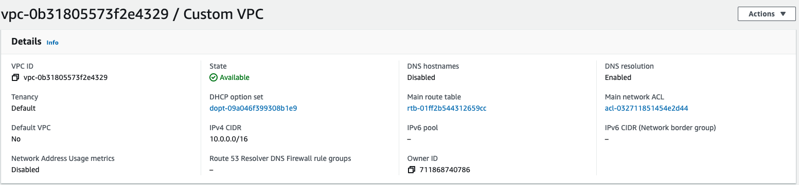
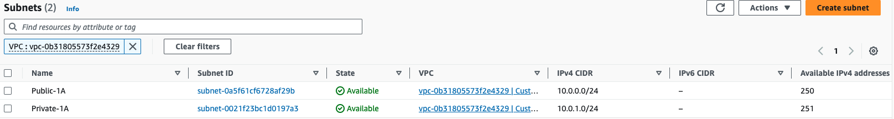
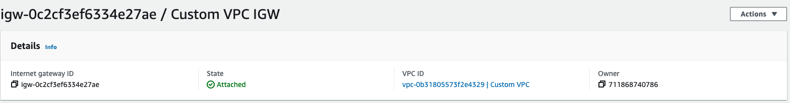
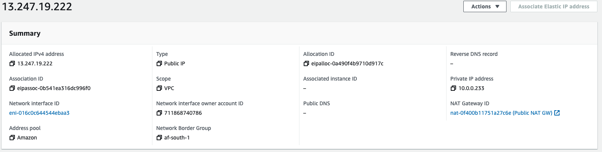
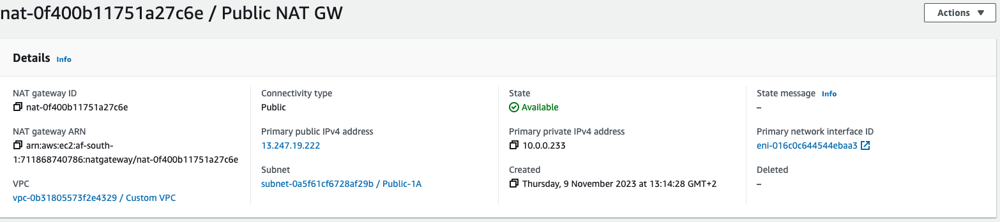
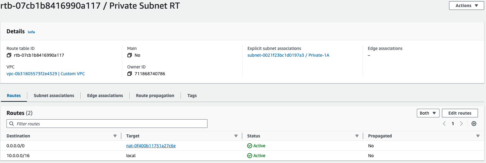

Amazon Virtual Private Cloud (VPC) is one of the core foundational services encountered when working with Amazon Web Services (AWS). It allows you to create a logically isolated virtual network in which AWS resources can be launched. 
A VPC is created within a region and subnets are created within a region's Availability Zones (AZs). 

In this guide, we'll be using Terraform to create a simple nondefault VPC with public and private subnets, configure an Internet Gateway (IGW) to allow public subnets to connect to the internet and a Network Address Translation (NAT) gateway to allow resources that reside in private subnets to connect to the internet.  The diagram below demonstrates the architecture we shall build.



Below is a resource map that illustrates the complete architecture of our VPC that is viewable once we have created all components.





## Prerequisites
To get started with this guide, we'll need to have the following:

 - [Terraform CLI](https://developer.hashicorp.com/terraform/tutorials/aws-get-started/install-cli)
 - [AWS CLI](https://docs.aws.amazon.com/cli/latest/userguide/getting-started-install.html)
 - AWS Acccount and credentials

  
## 1. Create a VPC
We will create our VPC named `Custom VPC` with IPv4 CIDR block `10.0.0.0/16` in `af-south-1` region. This will give us a total of 65,536  host IP addresses that can be assigned to resources created in the VPC. This CIDR block should not overlap with any existing VPC's CIDR block in your AWS region and cannot be modified once created.  

```terraform {style=github}
# Configure AWS Provider 
provider "aws" {
  region  = "af-south-1"
  profile = "terraform-user"
}

# Create a VPC
resource "aws_vpc" "custom_vpc" {
  cidr_block = "10.0.0.0/16"
  tags = {
    Name = "Custom VPC"
  }

}
```
The screenshot below was taken from the VPC dashboard in AWS Management Console. It shows the created VPC once the terraform configuration file is applied. Note the default main route table created and network ACL that were automatically provisioned. 



## 2. Create Subnets

Next we'll create a public subnet, `Public-1A` and a private subnet `Private-1A` in our VPC. The IPv4 CIDR block for `Public-1A` is `10.0.0.0/24` and `Private-1A` is `10.0.1.0/24`. Both subnets are created in `af-south-1a` region. Our public subnets will have a direct route to an Internet Gateway while private subnets will not route any traffic through an IGW. This is the main difference between public and private subnets. We will configure a NAT gateway which will permit outbound traffic from private subnets.

```terraform {style=github}
# Create Subnet associations with VPC
resource "aws_subnet" "public_subnets" {
  vpc_id            = aws_vpc.custom_vpc.id
  cidr_block        = "10.0.0.0/24"
  availability_zone = "af-south-1a"
  tags = {
    Name = "Public-1A"
  }
}

resource "aws_subnet" "private_subnets" {
  vpc_id            = aws_vpc.custom_vpc.id
  cidr_block        = "10.0.1.0/24"
  availability_zone = "af-south-1a"
  tags = {
    Name = "Private-1A"
  }
}
```
The screenshot shows subnets that have been created in our `Custom-VPC`




## 3. Create an Internet Gateway (IGW)

Here we create an IGW, `Custom VPC IGW`, and attach it to our VPC.  An internet gateaway is a horizontally scaled, highly available and redundant VPC component that allows communication between your VPC and the internet. Resources in subnets with a public IPv4 address or IPv6 address can connect to the internet through an IGW.


```terraform {style=github}
# Create an Internet Gateway 
resource "aws_internet_gateway" "igw" {
  vpc_id = aws_vpc.custom_vpc.id
  tags = {
    Name = "Custom VPC IGW"
  }

}
```


## 4. Create a Route Table

Earlier when we created our VPC, a route table was automatically created for us with implicit associations to our nondefault subnets. In this section we create a subnet route table and add a route with destination `0.0.0.0/0` and a target to our internet gateway `Custom VPC IGW`. This will direct all internet-bound traffic to the internet gateway.


```terraform {style=github}
# Create a route table with destination route 0.0.0.0/0
resource "aws_route_table" "public_subnet_rt" {
  vpc_id = aws_vpc.custom_vpc.id

  route {
    cidr_block = "0.0.0.0/0"
    gateway_id = aws_internet_gateway.igw.id
  }

  tags = {
    Name = "Public Subnet RT"
  }
}

# Explicitly associate public subnets with route table
resource "aws_route_table_association" "public_route_table_assocation" {
  route_table_id = aws_route_table.public_subnet_rt.id
  subnet_id      = aws_subnet.public_subnets.id

}
```


## 5. NAT Gateway 
To enable instances in private subnets to connect to the internet, we need to create a NAT gateway in a public subnet. This will allow outbound nternet traffic from instances in private subnets but inbound connection requests cannot be established. We create our public NAT gateway in a public subnet and associate it with an Elastic IP during creation.

### Elastic IP
An Elastic IP address is a static IPv4 address that is allocated to your AWS account and remains bound to your account until released. To read more about Elastic IP addresses see [here](https://docs.aws.amazon.com/AWSEC2/latest/UserGuide/elastic-ip-addresses-eip.html).
```terraform {style=github}
# Provision an Elastic IP
resource "aws_eip" "elastic_ip" {
  domain = "vpc"

  tags = {
    Name = "Elastic IP"
  }
}
```



Next we create a public NAT gateway and allocate the Elastic IP we have just created. 

```terraform {style=github}
# Create a NAT Gateway in Public Subnet
resource "aws_nat_gateway" "ngw" {
  subnet_id     = aws_subnet.public_subnets.id
  allocation_id = aws_eip.elastic_ip.id

  tags = {
    Name = "Public NAT GW"
  }

}
```



Lastly, we create a private route table in our private subnet and associate our NAT gateway  with it. Resources such as EC2 instances launched in this private subnet can send out request to the internet for security patches and updates but inbound connections are restricted. 

```terraform {style=github}
resource "aws_route_table" "private_subnet_rt" {
  vpc_id   = aws_vpc.custom_vpc.id

  route {
    cidr_block = "0.0.0.0/0"
    gateway_id = aws_nat_gateway.ngw.id
  }

  tags = {
    Name = "Private Subnet RT"
  }

}

resource "aws_route_table_association" "private_route_table_association" {
  route_table_id = aws_route_table.private_subnet_rt.id
  subnet_id = aws_subnet.private_subnets.id
}
```



## 6. Delete Resources
If you have been following along on your local workstation, it is important to remove unused resources to avoid unnecessary charges. We have used Terraform to manage our infrastructe, therefore the command below should remove all resources we have created so far.

```bash{style=github}
terraform destroy
```