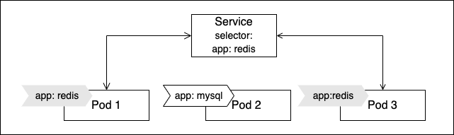
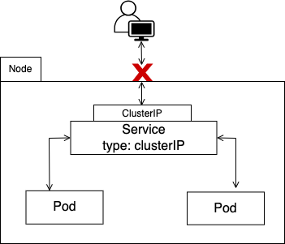
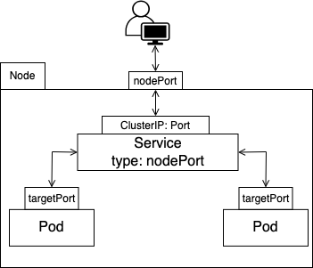
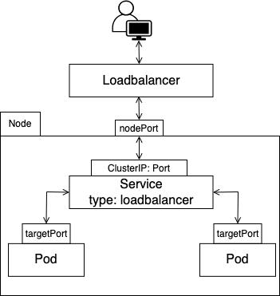

Kubernetes Pods use IP networking to interact with other resources within a cluster. Pods are, however, fungible resources; they assume a new identity when termintated and replaced. Kubernetes provides no guarantees that a Pods IP address will remain static if a controller replaces it. 

When a cluster state changes, it quickly becomes important to think about a service discovery layer that will facilitate communication between Pods in a cluster and connections from external resources. Kubernetes Service object resolves this. It provides a reliable and stable way to expose containerized applications running on a cluster to the outside world.

A Kubernetes Service is an abstraction which defines a logical set of Pods and a policy by which to access them. It acts as an intermediary for pods to communicate with each other. It does so by using selectors for accessing all the Pods that match a specific label and routes traffic to those pods.

The diagram below helps visualize a service object. `Pod1` and `Pod3` are labelled `app: redis` and `Pod2` is labelled `app: mysql`.  From the service perspective, `Pod1` and `Pod3` form a logical group through which traffic will be routed to based on the selector defined.



In this exercise, we'll be using [minikube](https://minikube.sigs.k8s.io/docs/start/) and [kubectl v1.21.5](https://kubernetes.io/docs/tasks/tools/#kubectl) to create and expose an redis deployment as a service.  We'll also look at the different types of service objects kubernetes provides.

### Create a Deployment Resource
1. Firstly, create a deployment with two pod replicas running `redis:alpine` image and set container port to `6379`
```
➜  ~ kubectl create deploy redis --image=redis:alpine --replicas=2 --port=6379
deployment.apps/redis created
```
2. Verify deployment is running. Selector in this instance defines how the created ReplicaSet from the Deployment finds which pods to manage
```
➜  ~ kubectl get deploy/redis -o wide
NAME    READY   UP-TO-DATE   AVAILABLE   AGE   CONTAINERS   IMAGES         SELECTOR
redis   2/2     2            2           31s   redis        redis:alpine   app=redis
```
3. Get managed pod names and IP address
```
➜  ~ kubectl get pods -l app=redis -o='custom-columns=NAME:metadata.name,IP:status.podIP'
NAME                     IP
redis-84fd6b8dcc-mdqst   10.244.0.19
redis-84fd6b8dcc-rs2f6   10.244.0.20
```

### Expose a resource as a Service
Create a ClusterIP service that exposes our deployment. Later we will look at what a ClusterIP service is and also look at other service types.

1. Expose a Deployment as a service

```
➜  ~ kubectl expose deploy/redis --name=redis-svc --type=ClusterIP
service/redis-svc exposed
```
2. Get service and selector
```
➜  ~ kubectl get service redis-svc -o wide
NAME        TYPE        CLUSTER-IP      EXTERNAL-IP   PORT(S)    AGE   SELECTOR
redis-svc   ClusterIP   10.104.83.129   <none>        6379/TCP   28s   app=redis
```
3. View service endpoints
```
➜  ~ kubectl get endpoints redis-svc
NAME        ENDPOINTS                           AGE
redis-svc   10.244.0.19:6379,10.244.0.20:6379   63s
```
### Test service connection

```
➜  ~ minikube service redis-svc --url
😿  service default/redis-svc has no node port
http://127.0.0.1:50485
```

```
➜  ~ redis-cli -u redis://127.0.0.1:50485/0 PING
PONG
```


## Types of Services 
There are four kinds of Services that Kubernetes provides. The field `spec.template.Type` on a Service manifest can be edited to describe how the service is exposed outside the cluster.

### 1. ClusterIP 
We previously created a ClusterIP service. This service type is only reachable from within a cluster. It allocates a cluster-internal IP address for loadbalancing to endpoints. 
This is useful for interservice communication within a cluster.



```
➜  ~ kubectl expose deploy/web --type=clusterIP --name=web-svc
```

### 2. NodePort
A NodePort service opens a port on all nodes in the cluster and redirects traffic received on that port to the underlying service. The port ranges is between 3000 - 32767.
We can patch our existing `web-svc` to `NodePort`. Port `32762` has been open on our cluster node.


```
➜  ~ kubectl patch svc redis-svc -p '{"spec": {"type": "NodePort"}}'
service/redis-svc patched

➜  ~ kubectl get svc redis-svc
NAME        TYPE       CLUSTER-IP      EXTERNAL-IP   PORT(S)          AGE
redis-svc   NodePort   10.104.83.129   <none>        6379:30688/TCP   5m
```
### 3. LoadBalancer
Similarly we can update our service definition as a LoadBalancer type. This works in tandem with cloud providers by exposing applications to the internet. It builds on NodePort and creates an external load balancer which routes to the same endpoints as the cluster IP.


```
➜  ~ kubectl patch svc redis-svc -p '{"spec": {"type": "LoadBalancer"}}'
service/redis-svc patched
```

### 4. ExternalName
Aliases the service to the specified external name `spec.externalName`

```
apiVersion: v1
kind: Service
metadata:
  name: redis-svc
  namespace: prod
spec:
  type: ExternalName
  externalName: server.example.com
```
